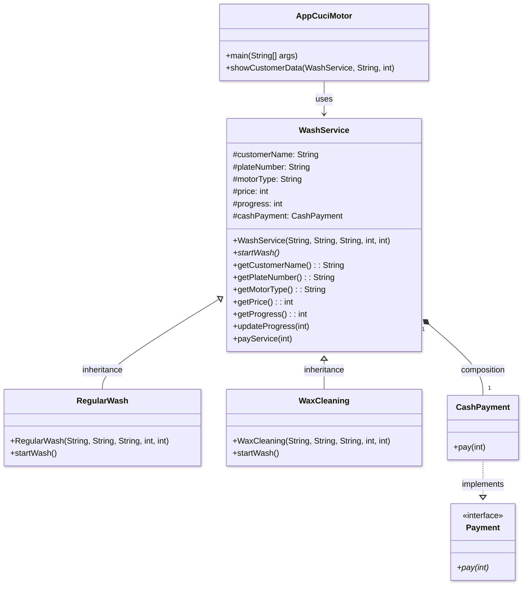
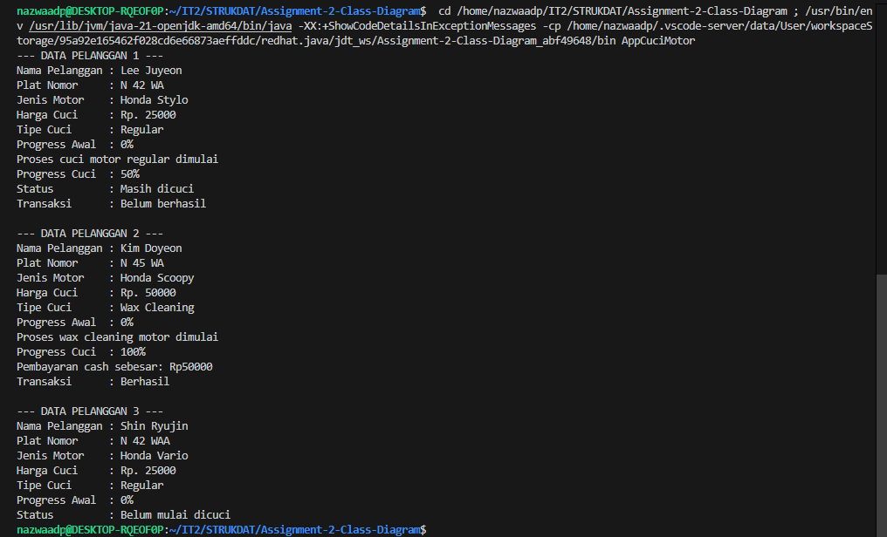

# Assignment 02 - Class Diagram

## Identitas
**Nama :** Nazwa Aulia Dwi Purnomo <br>
**NRP :** 5027251018 <br>
**Kelas :** B <br>
**Mata Kuliah :** Struktur Data dan Pemrograman Berorientasi Objek  <br>
**Kasus :** Sistem Pengelolaan Jasa Cuci Sepeda Motor

## Deskripsi Kasus

Program ini dibuat untuk membantu pengelolaan jasa cuci sepeda motor. Dalam kegiatan sehari-hari, proses pencucian motor tidak hanya sebatas mencuci kendaraan, tetapi juga melibatkan pencatatan data pelanggan, jenis motor, layanan yang dipilih, hingga status transaksi.

Melalui program ini, proses tersebut dimodelkan menggunakan `paradigma OOP` agar lebih terstruktur. Sistem dapat menampilkan informasi pelanggan, jenis layanan cuci yang digunakan, progres pencucian, serta status pembayaran. Pada implementasi ini digunakan tiga contoh pelanggan dengan kondisi yang berbeda, yaitu `motor yang masih dicuci`, `motor yang sudah selesai` dan berhasil dibayar, serta `motor yang belum mulai dicuci`.

Kasus ini dipilih karena dekat dengan kehidupan sehari-hari dan cukup relevan untuk menunjukkan penerapan konsep-konsep OOP secara sederhana namun tetap jelas.

## Class Diagram




## Kode Program Java

Program berada di dalam file [AppCuciMotor.java](AppCuciMotor.java)

```java
public class AppCuciMotor { // class induk
    public static void main(String[] args) { 

        // object customer1 dari class RegularWash
        RegularWash customer1 = new RegularWash(
            "Lee Juyeon", "N 42 WA", "Honda Stylo", 25000, 0
        );

        // object customer2 dari class WaxCleaning
        WaxCleaning customer2 = new WaxCleaning(
            "Kim Doyeon", "N 45 WA", "Honda Scoopy", 50000, 0
        );

        // object customer3 dari class RegularWash
        RegularWash customer3 = new RegularWash(
            "Shin Ryujin", "N 42 WAA", "Honda Vario", 25000, 0
        );

        // menampilkan data customer 1
        showCustomerData(customer1, "Regular", 1);

        customer1.startWash(); // memulai proses cuci customer 1
        customer1.updateProgress(50); // update progress customer 1 menjadi 50%
        System.out.println("Status         : Masih dicuci"); // status customer 1
        System.out.println("Transaksi      : Belum berhasil"); // transaksi belum berhasil karena belum selesai
        System.out.println(); 

        // menampilkan data customer 2
        showCustomerData(customer2, "Wax Cleaning", 2);

        customer2.startWash(); // memulai proses cuci customer 2
        customer2.updateProgress(100); // update progress customer 2 menjadi 100%
        customer2.payService(customer2.getPrice()); // melakukan pembayaran karena status pencucian selesai
        System.out.println(); 

        // menampilkan data customer 3
        showCustomerData(customer3, "Regular", 3);
        System.out.println("Status         : Belum mulai dicuci"); // customer 3 belum mulai dicuci
    }

    // method untuk menampilkan data customer agar tidak menulis print berulang-ulang
    public static void showCustomerData(WashService customer, String washType, int number) {
        System.out.println("--- DATA PELANGGAN " + number + " ---"); 
        System.out.println("Nama Pelanggan : " + customer.getCustomerName()); 
        System.out.println("Plat Nomor     : " + customer.getPlateNumber()); 
        System.out.println("Jenis Motor    : " + customer.getMotorType()); 
        System.out.println("Harga Cuci     : Rp. " + customer.getPrice()); 
        System.out.println("Tipe Cuci      : " + washType); 
        System.out.println("Progress Awal  : " + customer.getProgress() + "%"); 
    }
}

// abstract class = class induk umum untuk semua layanan cuci
abstract class WashService {

    // ENCAPSULATION = data pelanggan dibungkus di dalam class
    protected String customerName;
    protected String plateNumber;  
    protected String motorType;
    protected int price;
    protected int progress;

    // class WashService punya object CashPayment
    protected CashPayment cashPayment = new CashPayment();

    // constructor untuk isi data awal
    public WashService(String customerName, String plateNumber, String motorType, int price, int progress) {
        this.customerName = customerName;
        this.plateNumber = plateNumber;
        this.motorType = motorType;
        this.price = price;
        this.progress = progress;
    }

    // method abstract, isi detailnya akan dibuat di class turunan
    abstract void startWash();

    //setget
    public String getCustomerName() {  // getter untuk nama pelanggan
        return customerName;
    } public String getPlateNumber() { // getter untuk plat nomor
        return plateNumber;
    } public String getMotorType() { // getter untuk jenis motor
        return motorType;
    } public int getPrice() { // getter untuk harga
        return price;
    } public int getProgress() { // getter untuk progress
        return progress;
    }

    // method untuk update progress
    public void updateProgress(int newProgress) {
        this.progress = newProgress; // progress diganti dengan nilai baru
        System.out.println("Progress Cuci  : " + progress + "%"); // menampilkan progress terbaru
    }

    // method untuk pembayaran
    public void payService(int amount) {
        cashPayment.pay(amount); // memanggil method pay() dari object cashPayment
    }
}

// INHERITANCE = RegularWash mewarisi WashService
class RegularWash extends WashService {

    // constructor class RegularWash
    public RegularWash(String customerName, String plateNumber, String motorType, int price, int progress) {
        super(customerName, plateNumber, motorType, price, progress); // memanggil constructor parent
    }

    // POLYMORPHISM = method startWash() dioverride dari parent class
    @Override
    void startWash() {
        System.out.println("Proses cuci motor regular dimulai"); // aksi khusus untuk regular wash
    }
}

// INHERITANCE = WaxCleaning juga mewarisi WashService
class WaxCleaning extends WashService {

    // constructor class WaxCleaning
    public WaxCleaning(String customerName, String plateNumber, String motorType, int price, int progress) {
        super(customerName, plateNumber, motorType, price, progress); // memanggil constructor parent
    }

    // POLYMORPHISM = method startWash() dioverride dari parent class
    @Override
    void startWash() {
        System.out.println("Proses wax cleaning motor dimulai"); // aksi khusus untuk wax cleaning
    }
}

// INTERFACE = berisi aturan method yang harus dimiliki class implementasinya
interface Payment {
    void pay(int amount); // method untuk pembayaran
}

// INTERFACE IMPLEMENTATION = CashPayment mengimplementasikan interface Payment
class CashPayment implements Payment {

    // POLYMORPHISM = implementasi method dari interface
    @Override
    public void pay(int amount) {
        System.out.println("Pembayaran cash sebesar: Rp" + amount); 
        System.out.println("Transaksi      : Berhasil");
    }
}
```

## Screenshot Output

Contoh output program: <br>


## Penjelasan Prinsip-Prinsip OOP yang Diterapkan

### 1. Abstraction

Prinsip abstraction diterapkan pada `abstract class WashService`. Class ini berfungsi sebagai gambaran umum untuk semua jenis layanan cuci motor. Selain itu, method `startWash()` dibuat abstract agar detail proses pencucian ditentukan langsung oleh class turunannya.

### 2. Encapsulation

Prinsip encapsulation terlihat pada atribut seperti `customerName`, `plateNumber`, `motorType`, `price`, dan `progress` yang disimpan di dalam class `WashService`. Data tersebut kemudian diakses melalui method getter seperti `getCustomerName()`, `getPlateNumber()`, `getMotorType()`, `getPrice()`, dan `getProgress()`.

### 3. Inheritance

Prinsip inheritance diterapkan pada `RegularWash` dan `WaxCleaning` yang mewarisi class `WashService`. Dengan begitu, kedua class tersebut dapat menggunakan atribut dan method yang sudah dimiliki parent class tanpa perlu menuliskannya kembali.

### 4. Polymorphism

Prinsip polymorphism diterapkan melalui method overriding pada `startWash()`. Meskipun nama method yang digunakan sama, implementasinya berbeda sesuai jenis layanan. `RegularWash` menampilkan proses cuci regular, sedangkan `WaxCleaning` menampilkan proses wax cleaning.

### 5. Interface

Program ini juga menerapkan interface melalui `Payment`, yang kemudian diimplementasikan oleh `CashPayment`. Dengan pendekatan ini, proses pembayaran memiliki aturan yang jelas, yaitu setiap class yang mengimplementasikan `Payment` harus memiliki method `pay(int amount)`.

## Keunikan yang Membedakan dengan Individu Lain

Keunikan program ini terletak pada pemilihan kasus yang sederhana tetapi dekat dengan kehidupan sehari-hari, yaitu jasa cuci sepeda motor. Topik ini terasa lebih spesifik dan realistis. Selain itu, program ini tidak hanya menampilkan satu kondisi layanan, tetapi langsung memperlihatkan tiga situasi berbeda dalam satu sistem, yaitu:

* pelanggan yang masih dalam proses pencucian,
* pelanggan yang sudah selesai dan berhasil melakukan transaksi,
* pelanggan yang belum mulai dicuci.

Hal ini membuat program lebih menarik karena menggambarkan kondisi nyata yang bisa terjadi dalam pelayanan cuci motor, sekaligus menunjukkan bahwa sistem mampu menangani beberapa status layanan yang berbeda.

